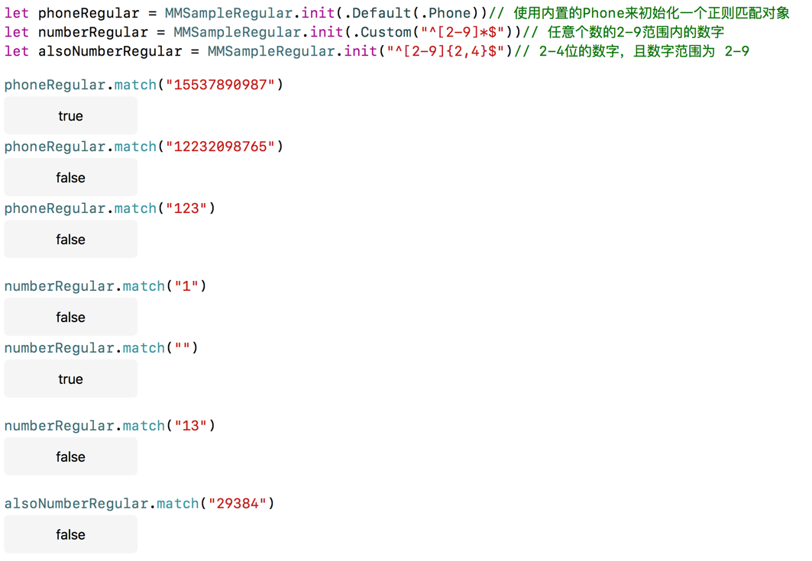

# MMSampleRegular
一个简单的可以进行正则匹配的结构体，根据`正则规则`、`接收数据`来判断是否可以正确匹配

----

#### 使用

```swift
let yourInputPhoneNumberString = "xxxxx"

// initialize
let phoneNumberValid = MMSampleRegular.init(.Default(.Phone))
// let phoneNumberValid = MMSampleRegular.init(.Custom("^((13[0-9])|(147)|(15[0-3,5-9])|(18[0,0-9])|(17[0-3,5-9]))\\d{8}$"))
// let phoneNumberValid = MMSampleRegular.init("^((13[0-9])|(147)|(15[0-3,5-9])|(18[0,0-9])|(17[0-3,5-9]))\\d{8}$")

// match  
phoneNumberValid.match(yourInputPhoneNumberString)

```


#### 特点

* 内置几种常用正则匹配规则
* 支持使用自定的正则匹配规则
* 接口简单易用


#### 不足

* 无法使内置的匹配规则进行组合使用

比如，如果一个需求是输入的内容既可以是手机号又可以是邮箱。这时候就只能创建两个MMSampleRegular实例，来进行 `||` 运算

``` swift
    var nameValid :Bool
    let phoneValid = MMSampleRegular.init(.Default(.Phone)).match(self.name)
    let emailValid = MMSampleRegular.init(.Default(.Email)).match(self.name)
    
    let passwordValid = MMSampleRegular.init("^[a-zA-Z0-9]{6,14}$").match(self.password)// [6,14]位的密码

    nameValid = phoneValid! || emailValid!
    ...
```


#### 测试


